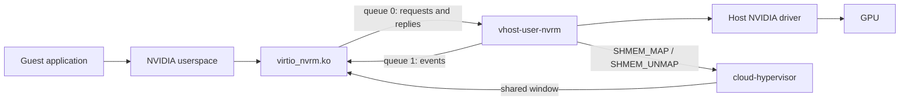

<!-- SPDX-License-Identifier: MIT -->
# Architecture

## Data path

- Guest applications load NVIDIA userspace matching the host driver.
- `virtio_nvrm.ko` owns the guest `/dev/nvidia*` nodes and forwards supported driver operations.
- One `vhost-user-nvrm` process serves one VM through a vhost-user socket.
- The host driver and GPU remain shared with the host and other backends.

## Request trace

For an ioctl on an already opened guest device:

1. NVIDIA userspace passes a payload to `virtio_nvrm`.
2. The guest copies supported fields into a request, replaces FDs with tokens and queues it on queue 0.
3. The backend selects the session, validates the request against the host ABI and resolves tokens to host FDs.
4. `Session::prepare` builds host buffers; `Session::execute` calls the NVIDIA driver.
5. The backend translates output fields and completes the request. The guest copies results to userspace.

Channel and mapping setup use this control path. GPU command buffers and mapped
submission registers carry subsequent GPU work; the backend does not translate
each GPU instruction. Isolation therefore depends on the objects and mappings
created during setup, not just the forwarded ioctl checks.

## Addresses

| Address | Meaning |
|---|---|
| Guest virtual address | Pointer in one guest process; cannot be dereferenced by the host |
| Guest physical address (GPA) | Guest RAM location resolved through the VMM's memory table |
| Host virtual address | Backend mapping or translated ioctl buffer |
| GPU virtual address | Address in an RM-created GPU address space |
| Shared-window offset | Location in region 1 where the VMM maps a host FD |

These address spaces are distinct. The request metadata selects the translation;
a numeric address alone establishes neither ownership nor permission.

## Request processing

- `Open` creates a host device FD; the reply exposes an opaque token, not the host FD number.
- The guest encodes inline parameters, auxiliary data, pointer offsets, and FD tokens.
- `nvrm.rs` handles device-level messages and routes the rest by `guest_proc`.
- `client_policy.rs` rejects references to private pool clients in reviewed RM/UVM layouts.
- `request_shape.rs` checks the selected host ABI's envelopes, pointer/FD metadata and buffer spans before scratch mutation or event acquisition.
- `Session::prepare` resolves device tokens and translates validated guest fields into host buffers and FDs.
- `Session::execute` calls the host driver, translates the reply, and updates bookkeeping after successful operations.
- `mirror.rs` retains the corresponding open file descriptions; NVIDIA associates RM clients and mapping contexts with them.
- `syscalls.rs` provides the driver-call interface used by rejection tests. Other modules also perform memory, event, and setup syscalls.

## Ownership

- **Per VM:** backend process, guest memory table, shared window, event routing, VRAM ledger, pin budget and private-client registry.
- **Per guest process:** `Session`, mirrored FDs, pending mappings, RM/event bookkeeping, and page pools.
- **Per RM client:** root handle and object handles. Identical object numbers can exist under different roots.
- Guest process IDs and cross-process FD owners come from the guest kernel; they are not host-authenticated identities.
- Known pointer/FD layouts are checked against host descriptors. Unannotated control/class fields still need an audit; driver authorization and accounting are separate checks.
- Separate backend processes do not prove GPU isolation. See [SECURITY.md](SECURITY.md).

## Shared mappings

- The hypervisor exposes an 8 GiB host-visible address window at shared-memory region 1.
- `MapPrepare` selects an offset; the host checks alignment, bounds, and overlap, probes the mapping, then sends `SHMEM_MAP`.
- The mapping retains a host FD. `MAP_RELEASE` releases the slot only after a successful `SHMEM_UNMAP` acknowledgement.
- The supported hypervisor negotiates `REPLY_ACK`; mapping correctness depends on receiving those acknowledgements. The backend library does not expose a hook here to require that selection.
- Failed unmaps retain the slot and FD to prevent reuse of a mapping the VMM may still hold.
- `PROC_GONE` attempts to release the process's mappings and drops its session.
- Guest GPA-backed OS descriptors and UVM pools are managed by `host_pool.rs`; these are distinct from the shared-window mappings.
- `host_pool::Backing` owns an internal RM client for page backing. Ordinary forwarded requests use guest-created clients.

## Guest-page backing

- One `PinBudget` serves every session in the VM. It counts page-rounded registrations while pending, active, retained or awaiting cleanup.
- `LEA_MAX_PIN_TOTAL_MIB` defaults to 1024; `LEA_MAX_PIN_MIB` limits each arena to 256 MiB. The aggregate default is provisional and needs repeated-workload validation.
- The budget is conservative registration accounting, not a count of unique physical pages or all NVIDIA memory.
- A private pool owner retains its arena, charge, UVM FD and RM client. Setup records each acquired resource; rollback frees only those resources.
- Cleanup order is UVM range, RM source object, then arena and charge. Failed cleanup retains the complete owner for retry; a failed final retry logs exceptional retention until backend exit.
- Pool ranges are keyed by UVM token and address. Duplicate or overlapping registrations on the same token are refused before allocation.
- Forwarded OS descriptors remain charged after source release because DUP/export/import aliases are not tracked. Retaining the host arena does not prevent the guest from reusing its pages.
- Guest contexts, requests and mappings retain device storage. Submitted allocations with uncertain outcomes retain guest backing, quota and module references in quarantine.
- Successful source teardown is not a final native-reference fence. A backing reference ledger and release protocol remain necessary; live SHMEM/NVKMS unbind is unsupported.

## Events

- The guest posts receive buffers on queue 1; the host writes `KIND_EVENT_FIRED` notifications.
- Host event controls use nested epoll. Registering directly with the worker from its event callback would reacquire the backend lock.
- Semaphore waiters use a separate polling thread. Registrations and poll snapshots own FDs; every arm has a generation.
- Installation and cancellation use acknowledged worker commands. Slots return to the free pool only after cancellation acknowledgement or a quiescent completion.
- Completions identify their generation; stale completions cannot retire a newer arm. Worker failure is reported instead of silently recycling slots.
- The guest interrupt callback queues work; callbacks execute from the workqueue.
- Missing receive buffers and full event rings cause counted drops.
- Poller quiescence does not prove GPU/DMA quiescence or callback lifetime after a notification reaches the guest. See [known risks](SECURITY.md#remaining-risks).

## ABI and protocol

- Wire definitions: [nvrm-wire](../crates/nvrm-wire/README.md), currently protocol version 6.
- Driver layouts: [abi.toml](../crates/nvrm-sys/abi.toml) and generated bindings/manifests.
- Runtime driver dispatch selects a compiled `RmAbi` implementation; unknown exact versions are refused.
- Guest library compatibility is an operator requirement; the protocol handshake does not compare guest library versions.
- `nvrm-abi` produces descriptor tables from the selected ABI. The guest C interpreter reads those tables.
- `nvrm-genhdr` generates `nvrm_wire.h` with layout assertions. Do not edit it manually.
- The guest still contains NVIDIA-specific UVM, event, and display handling; the descriptor interpreter is not the whole module.
- Unknown frontend envelopes, UVM tools, serialized RM layouts and selected untranslated controls/classes are refused. The [security policy](SECURITY.md#refused-operations) describes the current limits.

## Code map

- [virtio_nvrm](../guest-module/virtio_nvrm/README.md): guest transport, ioctl translation, mappings, events, virtual display.
- [nvrm_nodes](../guest-module/nvrm_nodes/README.md): guest parameters and diagnostic address translation.
- [vhost-user-nvrm](../crates/vhost-user-nvrm/README.md): device, session, memory, quota, and event modules.
- [nvrm-wire](../crates/nvrm-wire/README.md): shared wire types and limits.
- [nvrm-sys](../crates/nvrm-sys/README.md): generated driver ABI bindings.
- [nvrm-abi](../crates/nvrm-abi/README.md): translation metadata, mediation layouts, and C header generation.
- [nvrm-client](../crates/nvrm-client/README.md): direct RM diagnostics; not the forwarding backend.
- [nvrm-trace](../crates/nvrm-trace/README.md): userspace ioctl tracer.
- [Input](INPUT.md): upstream input backend and guest keyboard/mouse delivery.

## Repository and validation boundaries

- Core owns production Rust/C, wire/ABI definitions, `tools/build.sh`, `tools/check.sh` and canonical EDID/frame tools under `tests/tools/`.
- Leandro-Test is an optional, separately versioned harness for VM setup, probes, hardware gates and measurements. It consumes a selected core checkout or pinned input. Core builds and the [manual quickstart](QUICKSTART.md) require no Test files.
- Record core and harness revisions with automated hardware results.
- ABI generation, Rust/C layout agreement, C table decoding, rejection cases, and accounting rules have automated tests.
- Kernel builds check compilation against Linux 6.8 and 6.12; runtime gates remain separate.
- Deterministic tests cover cancellation/rearm, rollback failures, aggregate admission and malformed requests without NVIDIA calls.
- [TESTING.md](TESTING.md) defines the checks and their limits.
