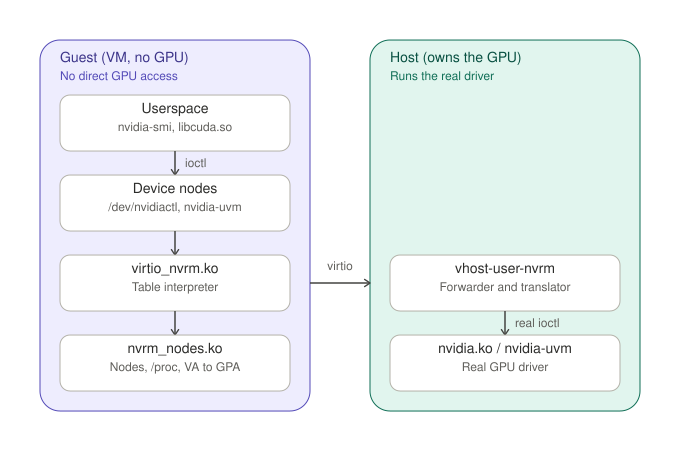

<!-- SPDX-License-Identifier: MIT -->
# Architecture

How the pieces fit together, and what each file is responsible for.

This describes the **current state**. It is deliberately separate from
[`OPEN-QUESTIONS.md`](OPEN-QUESTIONS.md), which records what is settled and
what is not, and from [`llm.md`](llm.md), which holds the measurements
behind them. When this document and the code disagree, the code is right
and this document is a bug.

---

## 1. The idea in one paragraph

An unmodified CUDA program runs inside a VM that has no GPU of its own. It
loads NVIDIA's **real** proprietary userspace (`libcuda.so`, the PTX JIT,
NVML) — none of that is replaced. What is replaced is the layer directly
underneath: the `ioctl` interface of `nvidia.ko`. In the guest, a driver
owns the `/dev/nvidia*` nodes and carries `open`/`ioctl`/`mmap` across the
VM boundary; on the host, a daemon executes those calls against the real
driver.

The cut is therefore **below the CUDA API and above the hardware**. That is
where the API completeness comes from: nothing needs to know what
`cudaMalloc` is, only what escape 0x2b with a 40-byte parameter block
means (an "escape" is an ioctl of RM, NVIDIA's Resource Manager — the
kernel driver behind `/dev/nvidiactl` and `/dev/nvidiaN`).

The price is stated plainly: the NVIDIA `ioctl` ABI has no stability
guarantee, so guest userspace and host kernel driver must be the **same
version**. Lockstep is a design assumption, not an oversight.

## 2. The two ends and what runs where

**One backend process per VM.** vhost-user carries exactly one device per
Unix socket, so `vhost-user-nvrm` is started once per guest. There is no
shared server. The consequence bites in practice: a dying backend makes its
`cloud-hypervisor` exit immediately, which looks like a guest crash and is
not one. Start order is backend first, then VM; stop order is the reverse.

**One session per guest process**, keyed on `Req.guest_proc` (the guest
kernel's dense per-process id). The guest
module keeps guest processes apart (one context per `struct file`, tokens
reachable only through the owning context). Across the VM boundary the VM
is the only unit the host can genuinely isolate — everything finer is a
statement by the guest kernel, and a compromised guest kernel can lie. This
is why an enforced limit belongs per VM and attribution per process is
*reporting* only.

## 3. The path of one call

1. The application calls `ioctl(fd, NV_ESC_RM_ALLOC, &params)` on a node
   that `virtio_nvrm.ko` owns.
2. The module looks the call up in the **descriptor table** the host sent at
   startup: how big is the payload, is there an embedded pointer, is there
   an fd field. It carries no NVIDIA knowledge of its own.
3. It copies the parameter block in, puts a request on virtqueue 0 and
   waits. (Queue 1 runs the other way and carries no requests: it is how
   RM's event firings reach the guest, so that a wait is woken rather than
   polled. Section 6a.)
4. The device side (`nvrm.rs`) hands the message to the session for that
   guest process.
5. The session (`session.rs`) checks it against a possibly lying guest,
   translates what has to be translated (fd fields → the host's mirrored
   FDs, guest addresses → host addresses), and calls into
   `syscalls.rs` — the only place that touches the kernel.
6. The real `ioctl` runs on the **mirrored FD**, i.e. exactly the open file
   description the guest used. The driver binds RM clients to the OFD, so
   this cannot be substituted.
7. The answer travels back; fields that name host things are translated
   back on the return path.

Memory mapping does not fit that shape and takes a second path: the guest
asks for a mapping (`MapPrepare`), and the host places it into a
**host-visible window** via `SHMEM_MAP`. The guest picks the offset because
it manages the window; the host validates it and answers with the
cacheability. This is the one thing the stock hypervisor cannot do, and
the reason for the shmem patch,
`patches/0001-generic-vhost-user-shmem.patch` (the second patch in the
series passes device feature bits through and does not affect
virtio-nvrm).

## 4. The wire protocol — `nvrm-wire`

Transport-independent by design, `PROTO_VERSION = 6`, little-endian, fixed
header plus payload, `MAX_PAYLOAD = 16384` (= `NV_ABSOLUTE_MAX_IOCTL_SIZE`).

**Routing is by token, not by fd number.** The host issues a token on
`Open` and keeps `token → host_fd` internally; the guest keeps a
placeholder fd and routes on the token. Guest fd numbers never mean
anything on the host.

| Kind | | Meaning |
|---|---|---|
| `Hello` | 0 | version handshake (`ioctl_nr` = `PROTO_VERSION`) |
| `Open` | 1 | open a device node, get a token; carries `ProcInfo` inline |
| `Close` | 2 | release a token |
| `Ioctl` | 3 | the ordinary forwarded call |
| `MapPrepare` | 4 | register a mapping and place it in the window |
| `UvmPoolBack` | 5 | back a UVM range with guest pages (UVM: NVIDIA's unified-memory driver, `/dev/nvidia-uvm`) |
| `KIND_GET_TABLES` | 6 | fetch the descriptor tables, paginated |
| `KIND_MAP_RELEASE` | 7 | take a mapping back out of the window |
| `KIND_PROC_GONE` | 8 | the guest process is gone, drop its session |
| `KIND_EVENT_FIRED` | 9 | host → guest only, on queue 1: an RM event fired (section 6a) |

Kinds 6–9 are deliberately **constants, not `Kind` variants**: the session
matches `Kind` exhaustively, so a message it should never see decodes as
`None` and is answered with `EPROTO` rather than silently misread. The
device intercepts them before that.

`DevTag` distinguishes the nodes: `Ctl` 0, `Gpu` 1, `Uvm` 2, `UvmTools` 3.
Everything is keyed on **(device, nr)**, never on `nr` alone — `0x27` is
`RM_ALLOC_MEMORY` on the ctl node and `PAGEABLE_MEM_ACCESS` on the uvm
node, two entirely different calls.

`ProcInfo` (24 bytes: `pid`, `comm`) travels inline with `Open`. The `pid`
is the guest's own view (`pid_vnr`), i.e. the number that resolves in the
guest's `/proc` — which is what makes per-process attribution possible at
all.

### There is no fallback transport, and none for the window either

Asked often enough to belong here. **`virtio-nvrm` is the only carrier.**
The Unix `SEQPACKET` transport and the `DRM_IOCTL_VIRTGPU_EXECBUFFER` one
spoke the same schema but were removed on 2026-08-04;
`UnixListener`, `UnixStream` and `SEQPACKET` appear nowhere in
`crates/vhost-user-nvrm/src/` except in two comments recording that
history. The `.sock` files are **not** a second data path: `vm/<name>/nvrm.sock`
and `vm/<name>/input.sock` are vhost-user **control** channels (one per
VM and device), and `vm/vsock<i>.sock` is cloud-hypervisor's hybrid-vsock
endpoint — it carries ssh for the NixOS guests and no RM traffic.

**The shared window is not optional either.** `MapPrepare` *is*
`SHMEM_MAP` — `nvrm.rs::on_map_prepare` places the host's mapping fd into
the host-visible region and answers with the cacheability; without that
region the call returns `EIO` ("MapPrepare without a backend channel").
Forwarded ioctls would still work, mappings would not, so there is no
CUDA: every allocation the guest wants to *touch* arrives through the
window. A transport that can carry ioctls but cannot map is not a degraded
mode of this design, it is a different one.

## 5. The components, and where each is documented

Every crate and both kernel modules carry a `README.md` next to their own
code, holding the reasoning that belongs to them. **This section is the
map, not a second copy.** Where the two disagree, the component README is
the one kept current — it sits next to the code that would have to change.

### Host side

| Component | What it is | README |
|---|---|---|
| `nvrm-sys` | generated bindings, locked to one driver version | [`crates/nvrm-sys`](../crates/nvrm-sys/README.md) |
| `nvrm-abi` | the ioctl level; `xlate.rs` is the single source of truth | [`crates/nvrm-abi`](../crates/nvrm-abi/README.md) |
| `nvrm-wire` | the guest ↔ host protocol, `PROTO_VERSION = 6` | [`crates/nvrm-wire`](../crates/nvrm-wire/README.md) |
| `nvrm-client` | RM client, object tree, transitive free | [`crates/nvrm-client`](../crates/nvrm-client/README.md) |
| `nvrm-trace` | the `LD_PRELOAD` measuring instrument — not a data path | [`crates/nvrm-trace`](../crates/nvrm-trace/README.md) |
| `vhost-user-nvrm` | the host daemon: pure forwarder and translator | [`crates/vhost-user-nvrm`](../crates/vhost-user-nvrm/README.md) |
| `vhost-user-input` | virtio-input as an external vhost-user backend | [`crates/vhost-user-input`](../crates/vhost-user-input/README.md) |

### Guest side

| Component | What it is | README |
|---|---|---|
| `virtio_nvrm.ko` | the carrier: owns `/dev/nvidia*`, interprets the descriptor table | [`guest-module/virtio_nvrm`](../guest-module/virtio_nvrm/README.md) |
| `nvrm_nodes.ko` | the helper: real chrdevs, `params`, VA → GPA without root | [`guest-module/nvrm_nodes`](../guest-module/nvrm_nodes/README.md) |

Both guest modules are currently required: the helper supplies `params`,
the carrier owns the nodes and the forwarding. They are loaded together,
`nvrm_nodes.ko` with `create_nodes=0`.

### How knowledge flows between them

One rule explains most of the shape:

    xlate.rs  --(table.rs)-->  descriptor stream  -->  nvrm_tables.c
       |                                                    |
       |  single source of truth                            |  interpreter,
       |  for every (device, ioctl_nr)                      |  holds no constant
       v                                                    v
    nvrm-wire  --(nvrm-genhdr)-->  nvrm_wire.h  --> virtio_nvrm.ko builds

**No NVIDIA constant is ever transcribed twice.** The guest module holds
none at all; it receives a table and interprets it. The C wire header is
generated from the Rust structs with a `_Static_assert` per offset, so the
module cannot be compiled against a stale layout. Both of those are checked
by `scripts/test.sh check` without a GPU, without a guest kernel and without a
VM — which is the only reason they stay true.

## 6. Invariants

Things that must hold, and where they are enforced:

| Invariant | Enforced by |
|---|---|
| Guest userspace and host driver are the same version | `assert_driver_version()`, `assert_layout!`, the `class-sizes` step of `test.sh check` |
| The generated C header matches the Rust wire structs | `_Static_assert` per offset; `nvrm-genhdr --check` |
| The table stream is read exactly as it was written | `tabcheck` differential test in `test.sh check` |
| A guest-supplied number is never used in unchecked arithmetic | `GuestAddr`/`GuestLen` have no arithmetic operators |
| An ioctl runs on the OFD the guest used | `mirror.rs` |
| One number lives in one place | `xlate.rs` is the source; `table.rs` verifies against it |
| A killed guest process leaks nothing | `KIND_PROC_GONE`, checked by the gate's accounting stage |

## 6a. The second virtqueue: events host -> guest

Everything above describes queue 0, which carries requests from the guest
and their answers back. Queue 1 runs the other way and carries no requests
at all.

RM signals through callbacks and event handles. Without a way to deliver
those to the guest, a `poll()` never wakes and every wait in the guest
falls back to its own 10 ms timer. That is survivable for compute -- no
measured CUDA path depends on it -- and it is fatal for a display, where a
10 ms floor per fence is most of a frame at 60 Hz. Measured before and
after: `fencetime` 10.10 ms -> 0.12 ms, Sunshine's frame time 62 ms ->
6 ms.

The shape, and each part of it is a boundary decision:

- The host pre-posts receive buffers on queue 1 and NEVER waits. No free
  buffer means the firing is dropped and counted there, because a host
  that blocks on a guest is a host a guest can stall.
- The guest's vq callback runs in interrupt context, so it does the least
  it can: copy the firing into a ring and schedule a work item. Nothing is
  CALLED from the interrupt -- neither the callbacks of NVKMS
  (nvidia-modeset.ko, the display half) nor a wait-queue lookup.
- The work item drains the ring in process context. A full ring drops and
  counts rather than blocking the callback.
- A guest-kernel callback is invoked only through a slot this module
  registered itself and cross-checked; a function pointer supplied by a
  guest PROCESS stays uncallable, and the userspace door keeps its
  `EOPNOTSUPP`.
- `NV9010_VBLANK_CALLBACK` (vblank: the per-frame vertical-blank tick)
  is not forwarded at all. The module services it from its own virtual
  display, with an hrtimer at `vdisplay_vblank_hz`.

Four ways to lose a firing, four counters
(`stat_events_drop_{ringfull,filtered,noslot,class}`), because "144k
dropped" read like a leak until the split showed most of them to be the
HOST monitor's DP_IRQ at 60 Hz, filtered on purpose. The one that costs
frames is `ringfull`, and it is the one that decided the ring's size —
the three-point sweep that sized it at 8192 lives with the ring's code
(`virtio_nvrm.c`, the event-queue header) and in
[`llm.md`](llm.md).

## 7. Where state lives

- **Per VM**: one backend process, two virtqueues, one host-visible window,
  one set of RM objects owned by the guest's own client.
- **Per guest process**: one `Session`, keyed on `Req.guest_proc`, holding
  the mirrored FDs, the pending mappings, the pool state and `ProcInfo`.
- **Nowhere**: there is no cross-VM state. That is what makes the VM the
  natural enforcement boundary.

## 8. What is deliberately absent

- No CUDA knowledge anywhere. The cut is the escape surface.
- No second interpreter of the ABI. There was one once (an `LD_PRELOAD`
  shim beside the module); two interpreters of the same knowledge were one
  too many, and it was removed rather than kept in sync.
- No enforcement finer than the VM. The VRAM policies
  (`LEA_VRAM_LIMIT_MIB`, or `LEA_VRAM_PROFILE_MIB` for the reserving one)
  and the guest-visible process list both exist (`vram.rs`), and all of
  them stop at the VM boundary: the ledger is one per backend, the
  per-process rows are reporting only, because everything below the VM is a
  statement of the guest kernel. What the cap does not count is in
  [`FUTURE.md`](FUTURE.md).
- **No enforcement ACROSS VMs either, and that is a decision rather than a
  gap.** One backend serves one VM and has no path to a sibling: it cannot
  see the card's total, its free memory or another tenant's charge, because
  it holds no RM client of its own. So a set of profiles that sums past the
  card is accepted -- overprovisioning is allowed, `lea_backend_start`
  warns when it can see it happening, and OPEN-QUESTIONS 67 records what it
  looks like when it goes wrong. Admission control and scheduling belong to
  a consumer of this project, for the reason in [`FUTURE.md`](FUTURE.md):
  this repository ships functionality, not a product.
